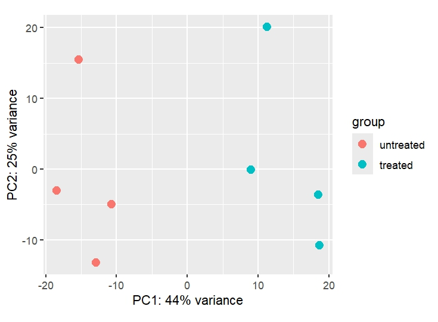

**###description of the course##**
course name- Bioinformatics course TO Learn RNA-Seq Data (NGS) Analysis From Zero through Linux and R for academia and industry

In Linux:
Installed the necessary programs- SAM tools and Trimmomatic tool
Quality check of the reads with FastQC and using trimmomatic to remove poor quality reads
Use of HISAT2 for alignment of reads with reference genome
Downloading GTF file to build feature count matrix using Subread tool
Processing multiple FastQ files using Bash scripts
In RStudio:
(Differential expression of gene analysis in R using Deseq2 package)\
Quality check of feature count matrix and metadata in R, basic quality check of data
Creating design for DEGs, removing rows with low count (leaky expression of gene)
Getting DEGs at different alpha values
Converting Gene IDs to gene name
Quality check of rnaseq data using PCA plots, inspecting size factor and dispersion plot
Building MA plot
Extraction of best genes
Building volcano plot and heatmap to represent this data

